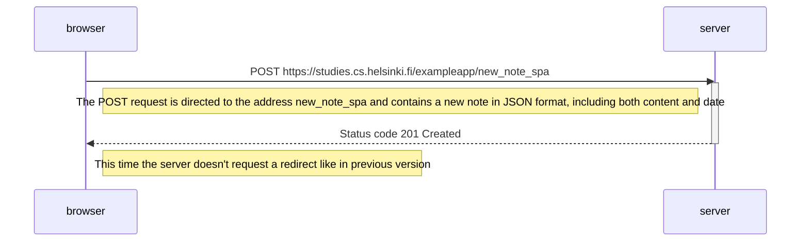

```mermaid
sequenceDiagram
    participant browser
    participant server

    browser->>server: POST https://studies.cs.helsinki.fi/exampleapp/new_note_spa
    activate server

    Note right of browser: The POST request is directed to the address new_note_spa and contains a new note in JSON format, including both content and date

    server-->>browser: Status code 201 Created
    deactivate server

    Note right of browser: This time the server doesn't request a redirect like in previous version
```